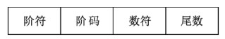

该笔记是我跟着 b 站 up 主学习软考记录的，视频链接：[软件设计师学习路线](https://www.bilibili.com/read/cv18526892?spm_id_from=333.999.list.card_opus.click)

# 第一章 计算机组成原理与结构

## 1.数据编码

### 1）原码

最高位为符号位，0 表示正数，1 表示负数，其他部分是数的绝对值。例如：
`0000 0001`表示`1`，`1000 0001`表示`-1`。

### 2）反码

最高位为符号位，0 表示正数，1 表示负数。当符号位为 0，其他部分是数的绝对值；

**当符号位 1，其余部分需要按位取反**。例如：
`0000 00001`表示`1`,`1000 0001`需要按位取反为`1111 1110`，所以表示`-126`。

### 3）补码

补码是为了解决负数计算时跨 0 的问题而出现，反码是为了解决不能解决负数运算的问题而出现

最高位为符号位，0 表示正数，1 表示负数。当符号位为 0，其他部分是数的绝对值；**当符号位 1，其余部分需要按位取反再加 1**。

在反码的基础上加 1

例如：
`0000 00001`表示`1`,`1000 0001`需要按位取反为`1111 1110`，再加 1 为`11111111`，所以表示`-127`。

- 特殊：负数原码取反加一得补码，那么补码变原码就是逆运算：补码减一取反 -（补码-1) 化简 -补码+1 也就是补码取反加一（补码再取补码等于源码）

⭐ 补码表示定点小数，范围是：[-1，(1-2^(-n+1))]，这个范围一共有 2^n 个数。

### 4）移码

在补码的基础上，把符号位与末尾取反颠倒过来

±0 的移码相同

### 范围

## 2.CPU 结构

主机=主存储器+中央处理器（CPU）

##### 运算器：（只能完成运算）

算术逻辑单元（ALU）负责处理数据，实现算术运算和逻辑运算

累加寄存器（AC）：`计算机通用寄存器` **当执行算术的运算时，为 ALU 提供一个工作区**

状态条件寄存器（PSW）：`用来存储运算过程中相关的(标志位：/中断进位等状态信息)`

##### 控制器：（保证程序的运行，处理异常事件）

指令寄存器（IR）:CPU 执行指令时，把指令从内存储器取到缓冲寄存器，在送入 IR 暂存

程序计数器（PC）：`记录下一条指令的位置`

## 3.存储系统

1. SRAM（静态随机存储器）
2. DRAM（动态随机存储器）
3. RAM（读/写存储器）
4. ROM（只读存储器）
5. PROM（可编程的只读存储器）

按寻址方式分类

- 随机存储器（RAM）
- 顺序存储器（SAM）
- 直接存储器（DAM）

Cache 与主存地址的映射是由硬件自动完成的

#### 中断

1.中断向量：提供中断服务程序的入口地址

2.中断响应时间：发出中断请求开始，到进入中断服务程序

3.保存现场：返回去继续执行原程序

#### 输入输出（I/O）控制方式

##### 1.程序查询方式

- CPU 和 I/O（外设）只能串行工作 CPU 需要一直轮询检查，长期处于忙等状态。CPU 利用率低
- 一次只能读/写一个字
- 由 CPU 将数放入内存

##### 2.中断驱动方式

- I/O 设备通过中断信号主动向 CPU 报告 I/O 操作已完成
- CPU 和 I/O（外设）可并行工作
- CPU 利用率得到提升
- 一次只能 读/写 一个字
- 由 CPU 将数据放入内存

##### 5.直接存储器方式（DMA）

- CPU 和 I/O（外设）可并行工作
- 仅在传送数据块的开始和结束时才需要 CPU 的干预
- 由外设直接将数据放入内存
- 一次读写的单位为”块“而不是字

## 4.进制以及数据

十六进制（H）

十进制（D）

八进制（O)

二进制（B)

### 计算机基本单位

位（比特）bit b 　 字节 byte B 千字节 KB 兆字节 MB 吉字节 GB 太字节 TB

1 B = 8 b 1 KB = 1024 B 1 MB = 1024 KB 1 GB = 1024 MB 1 TB = 1024 GB

1K 字节=1024 字节＝ 2 的 10 次方

1M 字节＝ 1024K 字节＝ 2 的 20 次方

1G 字节＝ 1024M 字节＝ 2 的 30 次方

## 5.定点数和浮点数

### 1)定点数

例题：机器字长为 n 的二进制数可以用补码表示多少个有符号定点小数（2015 年上半年）

（1）A. 2^n B. 2^n-1 C. 2^n-1 D. 2^2n-1 + 1

有符号定点小数的个数与定点整数是相同的，所以可以转换成整数计算

定点整数的补码表示范围是 -2^(n-1) ~ 2^(n-1)-1，同时补码的 0 的表示是唯一的，所以可以多表示出一个数据 10000000

所以表示个数是 2^(n-1)-1-(-2^(n-1) ) +1 = 2^n

### 2)浮点数

$$
N = M * R^E 例子：0.123 * 10^2
$$

M：尾数 R:基数 E:阶码

⭐ 浮点数表示的数值范围由阶码(E)决定，数值的精度由尾数(M)决定

⭐ 小阶码向大阶码对齐，同时将尾数右移 n 位

规格化：将尾数的绝对值限定在区间[0.5, 1]

## 6.寻址

- **立即寻址**：操作数就包含在指令中。
- **直接寻址**：操作数存放在内存单元中，指令中直接给出操作数所在存储单元的地址。
- **寄存器寻址**：操作数存放在某一寄存器中，指令中给出存放操作数的寄存器名。
- **寄存器间接寻址**：操作数存放在内存单元中，操作数所在存储单元的地址在某个
  寄存器中。
- **间接寻址**：指令中给出操作数地址的地址。
- 相对寻址：指令地址码给出的是一个偏移量（可正可负)，操作数地址等于本条指令的地址加上该偏移量。
- 变址寻址：操作数地址等于变址寄存器的内容加偏移量。

## 7.校验码

### 1）奇偶校验码

只能检错，不能纠错

### 2）海明码

码距 = 2 ，检错能力 码距 >= 3，才有可能有纠错能力

设数据位是 n 位，校验位是 k 位，则 n 和 k 必须满足以下关系：

$$
2^k-1 >= n + k
$$

### 3)循环冗余校验码

生成 k 个数据位产生 r 个校验位进行编码

采用的是模 2 运算

## 8.计算机体系结构分类--FLynn

## 9. CISC 与 RISC

🔺**常见考察：对二者描述选泽对错项**-> 故需掌握二者的区别比较

通用寄存器数量：（RISC）多，大量。 （CISC）一般

流水线技术：二者都支持

## 10.指令的流水处理

### 1）流水线基本概念

`流水线`的概念，就是在**程序执行时，多条指令重叠进行操作的一种准并行处理技术，可以提高各部件的利用率**。

### 2）流水线周期和执行时间的计算

⭐`流水线周期`，指的是**流水线执行过程中最长的一段**。

例题：如果有 `100` 条执行需要执行，每条指令取值 `3` 纳秒，分析 `4` 纳秒，执行 `1` 纳秒，那么使用流水线后需要多少时间？

**理论公式**的计算方法为：流水线执行时间=`指令全部的执行时间 + （n - 1）x 流水线周期（最长时间段）`。

也就是 `(3 + 4 + 1) + (100 - 1) * 4`，算出来答案为 `404`。

**实践公式**的计算方法为：流水线执行时间=`（K + N - 1） x 流水线周期`，其中 `k` 指的是工序数，题目中工序为取址、分析、执行，工序数为 `3`。

那么答案就是：`(3 + 100 - 1）* 4` ，算出来答案为 `408`。

### 3）流水线吞吐率计算

流水线 `吞吐率`，指的是**单位时间内，流水线所完成的指令数量**。

**吞吐率 = 指令条数 / 流水线执行时间**。

### 4）流水线加速比

**流水线加速比 = 不使用流水线执行时间 / 使用流水线执行时间**

## 11.加密技术与认证技术

- 加密技术：
  1.  对称加密（私有密钥加密）
      加密和解密是同一把密钥，只有一把密钥
      密钥分发有缺陷     1. 加密解密速度很快 2. 适合加密大量明文数据
  2.  非对称密钥（公开密钥加密）
      加密和解密不是同一把密钥，一共有两把密钥 分别是公钥和私钥
      用公钥加密只能用私钥解密 用私钥加密只能用公钥解密
      不能通过一把推出另一把 用接收方的公钥加密明文，可以实现防止窃听的效果
      密钥分发没有缺陷 1.加密解密速度很慢
  3.  混合加密
- 认证技术：
  1.  摘要：将发送的明文进行 Hash 算法后得到的摘要放在密文后一起发送过去，与接收方解密后的明文进行相同的 Hash 算法得到的摘要进行对比，如果一致，则没有篡改，否则有篡改。
  2.  数字签名：发送方用自己的私钥对摘要进行签名（加密）得到数字签名放在密文后一起发送过去
      接收方用发送方的公钥对数字签名进行验证（解密）如果验证成功则该消息没有被假冒且不能否认，否则该消息的真实性为假冒发送。
  3.  数字证书：用户向 CA（权威机构）机构申请数字证书，将个人信息和公钥发给 CA 机构，CA 机构颁给用户数字证书，数字证书用 CA 的私钥进行签名（加密）用 CA 的公钥验证（解密）数字证书得到用户的公钥。

认证是处理主动攻击

| 对称密钥（私钥、私有密钥加密）算法（共享密钥加密算法） | 非对称密钥（公钥、公开密钥加密）算法 |
| :----------------------------------------------------- | ------------------------------------ |
| DES                                                    | RSA                                  |
| 3DES                                                   | ECC                                  |
| RC-5                                                   | DSA                                  |
| IDEA                                                   |                                      |
| AES                                                    |                                      |
| RC4                                                    |                                      |

Hash 函数

MD5 摘要算法（128 位散列值）

SHA-1 安全散列算法操作系统

## 12.计算机可靠性

计算机可靠性模型

串联系统：

$$
R₁R₂···Rn
$$

并联系统：

$$
1-(1-R₁)(1-R₂)···(1-Rn)
$$

# 第二章 程序设计语言

## 1.程序设计语言的基本概念

解释器：在解释方式下，翻译源程序时不生产独立的目标程序。

解释程序和源程序要参与到程序的运行过程中。

编译器：翻译时将源程序翻译成独立保存的目标程序。

机器上运行的是与源程序等价的目标程序，源程序和编译程序都不再参与目标程序的运行过程。

许多程序设计语言规定，程序中的数据必须具有类型，其作用是：

1. 便于为数据合理分配存储单元
2. 便于对参与表达式计算的数据对象进行检查
3. 便于规定数据对象的取值范围及能够进行的运算

## 2.程序设计语言的基本成分

成分包括：数据、运算、控制和传输

#### 1）函数定义

函数的定义包括两部分：函数首部和函数体。函数的定义描述了函数做什么和怎么做。

函数定义的一般形式为：

> 返回值的类型 函数名(形式参数表) //函数首部 函数名(实参表)；
>
> {
>
> ​ 函数体；
>
> }

(1)值调用（Call by Value）。若实现函数调用时将实参的值传递给相应的形参， 则称为是传值调用。在这种方式下形参不能向实参传递信息。

(2)引用调用（Call by Reference）。引用是 C++ 中引入的概念，当形式参数为引用类型时，形参名实际上是实参的别名，函数中对形参的访问和修改实际上就是针对相应实参所做的访问和改变。

传值调用：

将实参的值传递给形参，实参可以是变量、常量和表达式。

不可以实现形参和实参间双向传递数据的效果。

传引用（地址）调用：

将实参的地址传递给形参，形参必须有地址，实参不能是常量（值），表达式。可以实现形参和实参间双向传递数据的效果，即改变形参的值同时也改变了实参的值。

#### 2) 编译程序基本原理

编译方式：词法分析、语法分析、语义分析、中间代码生成、代码优化、目标代码生成
解释方式：词法分析、语法分析、语义分析

编译器和解释器都不可省略词法分析、语法分析、语义分析且顺序不可交换
即词法分析、语法分析、语义分析是必须的。

编译器方式中中间代码生成和代码优化不是必要，可省略。
即编译器方式可以在词法分析、语法分析、语义分析阶段后直接生成目标代码

符号表：

不断收集、记录和使用源程序中一些相关符号的类型和特征等信息，并将其存入符号表中。

记录源程序中各个字符的必要信息，以辅助语义的正确性检查和代码生成。

##### ① 编译过程概述

1）词法分析

输入：源程序

输出：记号流

词法分析阶段的主要作用是 分析构成程序的字符及由字符按照构造规则构成的符号，是否符合程序语言的规定。

2）语法分析

输入：记号流

输出：语法树（分析树）

语义分析阶段可以发现程序中所有的语法错误

语法分析阶段的主要作用是 对各条语句的结构进行合法性分析，分析程序中的句子结构是否正确。

3）语义分析

输入：语法树（分析树）

语义分析阶段的主要作用是进行`类型分析`和`检查`

语义分析阶段不能发现程序中所有的语义错误

语义分析阶段可以发现**静态**语义错误，不能发现动态语义错误，动态语义错误运行时才能发现

4）中间代码生成
常见的中间代码有：后缀式、三地址码、三元式、四元式和树（图）等形式。

中间代码与具体的机器无关（不依赖具体的机器）,可以将不同的高级程序语言翻译成同一种中间代码。

中间代码可以跨平台。

因为与具体的机器无关，使用中间代码有利于进行与机器无关的优化处理和提高编译程序的可移植性。

6）目标代码生成

目标代码生成阶段的工作与具体的机器密切相关

寄存器的分配工作处于目标代码生成阶段

有限自动机是词法分析的一个工具，它能正确地识别正规集

确定的有限自动机（ DFA )：对每一个状态来说识别字符后转移的状态是唯一的

不确定的有限自动机（ NFA )：对每一个状态来说识别字符后转移的状态是不唯一的

##### ② 词法分析

正规式

有限自动机

是词法分析的一个工具，它能够准确地识别正规集

确定的有限自动机(DFA)：对每一个状态来说识别字符后转移的状态是唯一的

不确定的有限自动机(NFA)：对每一个状态来说识别字符后转移的状态是不唯一的

③ 语法分析

程序设计语言的绝大多数语法规则可以采用上下文无关文法进行描述

④ 中缀式|后缀式

# 第三章 数据结构 🔺

## 1.线性结构

### 1）线性表

采用`顺序存储`和`链式存储`，主要基本操作插入、删除、和查找

链式存储：单链表，双链表

### 2）栈和队列

优先队列采用堆数据结构实现

### 3）串

串的前缀：包含第一个字符并且不包含最后一个字符的子串

串的后缀：包含最后一个字符病区不包含第一个字符的子串

第 i 个字符的 next 值 = 最长相等前后缀长度 + 1

## 2.数组、矩阵、广义表

### 1）一维数组、二维数组

一维数组：

LOC:第一个元素的首地址、L:元素的大小

$$
下标从0开始：a_i = LOC + i * L
$$

$$
下标从1开始：a_i = LOC + (i-1) * L
$$

二维数组：

LOC:第一个元素的首地址、M：行数、N：列数、L：元素大小

按行存储：

$$
按行优先存储并且下标从0开始：a_i,_j = LOC + (i * M + j) * L
$$

$$
按行优先存储并且下标从1开始：a_i,_j = LOC + [(i-1) * M + (j-1)] * L
$$

按列存储：

$$
按列优先存储并且下标从0开始：a_i,_j = LOC + (j * M + i) * L
$$

$$
按列优先存储并且下标从1开始：a_i,_j = LOC + [(j-1) * M + (i-1)] * L
$$

### 2）矩阵

对称矩阵`按行存储`下三角区和主队角线

下标从 0 开始：

$$
当 i>= j，A_i,_j = \frac{i(i+1)}{2} +j + 1
$$

$$
当i <= j，A_i,_j = \frac{j(j+1)}{2} +i + 1
$$

下标从 1 开始：

$$
当 i>= j，A_i,_j = \frac{(i-1)i}{2} +j
$$

$$
当 i<= j，A_i,_j = \frac{(j-1)j}{2} +i
$$

三对角矩阵

下标从 0 开始：

$$
A_i,_j = 2i + j + 1
$$

下标从 1 开始：

$$
A_i,_j = 2i + j - 2
$$

三元组顺序表和十字链表是对稀疏矩阵进行压缩存储的方式

## 3.树(非线性结构)

### 1）树的定义

性质：

$$
1. 树中的结点总数等于树中所有结点的度数之和加1\\
2. 度为m的树中第i层上至多有m^{i-1}结点\\
3. 高度为h的m(度为m时)次树至多有\frac{m^h-1}{m-1}\\
4. 具有n个结点、度为m的树的最小高度为[log_m(n(m-1)+1)]
$$

### 2）二叉树的定义

二叉树结点的最大度数为 2，而树中不限制结点的度数

性质：

$$
1.二叉树第i层(i\ge1)上最多有2^{i-1}个结点\\
2.高度为h的二叉树最多有2^h-1个结点\\
3.对于任何一棵二叉树，度为0的结点数等于度为2的结点数+1\\
4.具有n个结点的完全二叉树的高度为[log_2n]+1或[log_2(n+1)]\\
根据结点推测二叉树有几种用卡特兰树=\frac{C^n_{2n}}{n+1}\\
C^m_n=\frac{n!}{m!(n-m)!}
$$

关于卡特兰数相关题：[96. 不同的二叉搜索树 - 力扣（LeetCode）](https://leetcode.cn/problems/unique-binary-search-trees/)

### 3）二叉树的存储结构

#### ① 二叉树的顺序存储结构

#### ② 二叉树的链式存储结构

二叉链表：n 个结点有 n+1 个空指针域

三叉链表：n 个结点有 n+2 个空指针域

### 4）二叉树的遍历算法

（1）先序遍历（根左右）

1. 访问根节点
2. 先序遍历左子树
3. 先序遍历右子树

（2）中序遍历（左根右）

1. 中序遍历左子树
2. 访问根节点
3. 中序遍历右子树

（3）后序遍历（左右根）

1. 后序遍历左子树
2. 后序遍历右子树
3. 访问根节点

（4）层次遍历

1. 访问根节点
2. 从左到右...到 h 层所有结点

平衡二叉树：二叉树中的任意一个结点子树高度之差不超过 1

二叉排序树：

根节点的关键字 ，

大于左子树所有结点的关键字，

小于右子树所有介蒂安的关键字，

左右子树也是一颗二叉排序树

最优二叉树（哈夫曼编码）

等长编码:2 的 x 次方>=5

采用贪心策略

n 个权值构造的最优二叉树，结点总数为 2n-1

### M 阶 B-树：

1. 树中每个结点至多有 m 课子树
2. 若根节点不是叶子结点，则至少有两颗子树
3. 除根之外的所有非终端结点至少有[m/2]课子树

## 4.图

### 1）图的定义

边数:e |顶点数:n

1.有向图：每条边都有方向，用<vi,vj><vj,vi>表示两条边

顶点的度：入度和出度之和 或 2e

强连通图：最少有 n 条边 最多有 n(n-1)条边

2.无向图：每条边都没有方向，用(vi,vj)(vj,vi)表示两条边

度：2e

连通图：最少有 n-1 条边 最多有 n(n-1)/2 条边

3.完全图：n个定点的无向完全图共有[n(n-1)/2]条边

### 2）图的存储结构

邻接矩阵表示法

非零元素个数：

有向图：e，无向图：2e

邻接链表表示法

有向图的表结构个数：e=邻接矩阵

有向图的表结构个数：2e

邻接矩阵

稠密图：n 的平方 适合用邻接矩阵存储

稀疏图：n+e 适合用邻接表存储

### 3）图的遍历

图的遍历指的是从某个顶点出发沿着某条搜索路径出发

1.深度优先搜索 DFS（栈）

图 ：查找所有顶点的邻接点所需时间

邻接矩阵：O（n^2）

邻接表：O(n+e)

2.广度优先搜索 BFS（队列）

邻接矩阵：O（n^2）

邻接表：O(n+e)

拓扑网（AOV 网）

有向且无环图，顶点 vi 在 vj 之前，则：

可能存在弧<vi,vj>，一定不存在弧<vj,vi>

可能存在 vi 到 vj 的路径，一定不存在 vj 到 vi 的路径

拓扑排序及算法

（1）在 AOV 网中选择一个入度为 0（没有前驱）的顶点且输出它

（2）从网中删除该顶点及与该顶点有关的所有弧

（2）重复上述两步，直到网中不存在入度为 0 的顶点为止

## 5.查找

静态查找表：顺序查找（少），折半（二分）查找（多），分块查找（无）

动态查找表：二叉排序树，平衡二叉树，B\_树（少），哈希表

### 1）静态查找表

1.顺序查找(有序)

**顺序查找**的方法对于**顺序存储**方式和**链式存储**方式的查找表都适用

顺序查找成功的平均查找长度为（n+1）/2

2.折半查找（二分查找）

$$
最多比较次数：\lfloor log_2n \rfloor+1次\\
平均查找长度为：log_2(n+1)-1
$$

### 2）哈希表

常用的哈希函数构造方法有直接定址法、数字分析法、平方取中法、折叠法、随机数法和`除留余数法`

除留余数法：m 一般取接近 n 但不大于 n 的质数

解决冲突用`线性探测法`，线性探测法是用冲突结果+1 模哈希表长度得到新的位置

装填因子 α

α 代表哈希表的装满程度，α 越小，发生冲突的可能性越小；反之越大

## 6.排序

| 排序方法     | 平均时间复杂度 | 最坏时间复杂度 | 最好时间复杂度 | 辅助空间 | 稳定性 |
| ------------ | -------------- | -------------- | -------------- | -------- | ------ |
| 直接排序     | O(n^2)         | O(n^2)         | O(n)           | O(1)     | 稳定   |
| 简单选择排序 | O(n^2)         | O(n^2)         | O(n^2)         | O(1)     | 不稳定 |
| 冒泡排序     | O(n^2)         | O(n^2)         | O(n)           | O(1)     | 稳定   |
| 希尔排序     | O(n^1.3)       | O(n^2)         | O(n)           | O(1)     | 不稳定 |
| 快速排序     | O(nlogn)       | O(n^2)         | O(nlogn)       | O(logn)  | 不稳定 |
| 堆排序       | O(nlog n)      | O(nlog n)      | O(nlog n)      | O(1)     | 不稳定 |
| 归并排序     | O(nlog n)      | O(nlog n)      | O(nlog n)      | O(n)     | 稳定   |
| 基数排序     | O(d(n+rd))     | O(d(n+rd))     | O(d(n+rd))     | O(rd)    | 稳定   |
|              |                |                |                |          |        |

基本有序的数组进行排序，最适宜采用的算法为**插入排序，时间复杂度为 O(n)**

简单选择排序：归位，不稳定

堆排序：归位

快速排序：归位，不稳定，是一种分治算法

归并排序：稳定，是一种分治算法

# 第四章 操作系统

## 分页存储管理

分页原理：

- 页：
- 块：

## 设备管理

🔺I/O 管理软件：

| 用户进程     |
| :----------- |
| 设备无关进程 |
| 设备驱动进程 |
| 终端处理程序 |
| 硬件         |

#### 缓冲技术

- 硬件缓冲：利用硬件寄存器作为 缓冲
- 软件缓冲：通过操作系统来管理

#### 单缓冲

计算公式：🔺（T + M）\* n + c //n 为数据

#### 双缓冲

计算公式：🔺T \* n + M +c

## 软件管理

索引文件结构

一般的索引文件结构**由 13 个结点组成**，其中 0 - 9 个结点为直接的物理盘块（直接索引），第 10 个结点是**一级间接索引**，第 11 个结点是**二级间接索引**，第 12 个结点是**三级间接索引**，如下图所示：

# 第六章 结构化开发方法

### 模块独立

#### 🔺 耦合

耦合是模块之间的相对独立性（互相连接的紧密程度）的度量。耦合取决于各个模块之间接口的复杂程度、调用模块的方式以及通过接口的信息类型等。

七种耦合类型根据耦合程度由高到低排序分别是：内容耦合>公共耦合>外部耦合>控制耦合>标记耦合>数据耦合和非直接耦合。

- 无直接耦合：指两个模块之间**没有直接**的关系，属于不同模块。
- 数据耦合：指两个模块之间有调用关系，传递的是简单的数据值。
- **标记耦合**：指两个模块之间传递的是数据结构。
- 控制耦合：指一个模块调用另一个模块时，传递的是控制变量。
- 外部耦合：模块间通过软件之外的环境联结。
- 公共耦合：通过一个**公共数据环境**相互作用。
- 内容耦合：当一个模块直接使用另一个模块的**内部数据**，或通过非正常入口转入另一个模块内部。

#### 🔺 内聚

内聚是对一个模块内部各个元素彼此结合的紧密程度的度量。

- 偶然内聚（巧合内聚）：各处理元素之间**没有任何联系**。
- 逻辑内聚：模块内执行若干个**逻辑上**相似的功能。
- 时间内聚：把需要**同时执行的动作组合**在一起。
- 过程内聚：指定的过程执行。
- 通信内聚：模块内的所有处理元素都在**同一个数据结构**上操作。
- 顺序内聚：指一个模块中的各个处理元素都密切相关于同一功能且必须顺序执行。
- 功能内聚：最强的内聚，指模块内的所有元素共同作用完成一个功能，缺一不可。

总结：耦合性和内聚性是模块独立性的两个定性标准，在将软件系统划分模块时，应尽量做到高内聚、低耦合，提高模块的独立性。

# 第七章 面向对象技术

## 1.基础概念

面向对象 = 对象（Object）+ 分类（Classification）+ 继承（Inheritance）+通过消息的通信

### 1）对象

对象通常可由对象名、属性和方法 3 个部分组成。

### 2）继承

继承是父类和子类之间共享数据和方法的机制

一个子类可以继承父类（或祖先类）中的属性和方法

### 3）多态

多态有不同的形式，分为了四类：

- 通用的：
- 参数多态：应用比较广泛的多态，被称为最纯的多态。
- 包含多态：在许多语言中都存在，最常见的例子就是子类型化，即一个类型是另一个类型的子类型。
- 特定的：
  - 过载多态：同一个名字在不同的上下文中所代表的含义不同。
  - 强制多态：通过强制类型转换（也称为强制转型）将一个对象或变量视为另一个类型的操作。

## 2.面向对象分析

面向对象分析包含 5 个活动：认定对象、组织对象、描述对象间的相互作用、确定对象的操作、定义对象的内部信息。

## 3.面向对象设计

### 1）面向对象设计的活动

面向对象设计的活动（OOD 在复用 OOA 模型的基础上，包含与 OOA 对应如下五个活动）：

1. 识别类及对象
2. 定义属性
3. 定义服务
4. 识别关系
5. 识别包

### 2）面向对象设计的原则

面向对象方法中的五大原则：

1. 单一责任原则：就一个类而言，应该仅有一个引起它变化的原因。
2. 开放-封闭原则：软件实体应该是可以扩展的，即开发的；但是不可修改的，即封闭的。**（扩展开放、修改关闭）**
3. 里氏替换原则： 子类型必须能够替换掉他们的基类型。**（基类出现的地方，子类一定可以出现）**
4. 依赖倒置原则：抽象不应该依赖于细节，细节应该依赖于抽象。**（依赖于抽象，而不依赖于细节[实现]）**
5. 接口分离原则：不应该强迫客户依赖于它们不用的方法。**（依赖于抽象，不依赖于具体）**

共同封闭原则：包中的所有类对于同一类性质的变化应该是共同封闭的。**一个变化若对一个包产生影响，则将对该包中的所有类产生影响，而对于其他的包不造成任何影响**。

共同重用原则：一个包中的所有类应该是共同重用的。**如果重用了包中的一个类，那么就要重用包中的所有类**。

## 4. UML

#### 1）事物

UML 中有 4 中事物：

1. 结构事物：结构事物是 UML 模型中的**名词**，通常是模型的**静态部分**，描述概念或物理元素。
2. 行为事物：行为事物是 UML 模型的**动态部分**，它们是模型中的**动词**，描述了跨越时间和空间的行为。
3. 分组事物：分组事物是 UML 模型的**组织部分**，是一些由模型分解成“盒子”。
4. 注释事物：注释事物是 UML 模型的解释部分。这些注释事物用来描述、说明和标注模型的任何元素。

#### 2）关系

UML 中有 4 种关系：依赖、关联、泛化和实现。

1. 依赖：依赖是两个事物间的**语义关系**，其中一个事物（独立事物）发生变化会影响另一个事物（依赖事物）的语义

   

2. 关联：关联是一种**结构关系**，它描述了一组链，链是对象之间的连接。

   - 聚合：部分和整体的生命周期不一致，整体消失了，部分仍然存在，部分可以脱离整体存在

   

   - 组合：部分和整体的生命周期一致，整体消失了，部分也消失了，部分不可以脱离整体存在。

3. 泛化：泛化是一种特殊/一般关系，特殊元素（子元素）的对象可替代一般元素（父元素）的对象。子元素共享了父元素的结构和行为。

   

4. 实现（了解）：实现是类元之间的语义关系，其中一个类元指定了由另一个类元保证执行的契约。

### UML 中的图

#### UML 图汇总

- 静态建模：类图、对象图、用例图
- 动态建模：序列图（顺序图、时序图）、通信图（协作图）、状态图、活动图
- 物理建模：构件图（组件图）、部署图
- 交互图：序列图（顺序图、时序图）、通信图（协作图）

#### 1.类图

类图（Class Diagram）展现了一组**对象、接口、协作**和它们之间的关系。

符号：

`+` : public 公有的

`-`  : private 私有的

`#` : protected 受保护的

`~` : package 包的

🔺 通常以下述 3 种方式之一使用类图：

1. 对系统的词汇建模。
2. 对简单的协作建模。
3. 对逻辑数据库模式建模。

#### 2.对象图

对象图（Object Diagram）展现了某一时刻**一组对象**以及它们之间的关系，描述了在类图中所建立的事物的实例的**静态快照**。

对象图给出系统的**静态设计视图**或**静态进程视图**。

#### 3.🔺 用例图（P368)

用例图（Use Case Diagram）展现了一组用例、参与制（Actor）以及它们之间的关系。

一个用例执行的时候，可能会发生一些特殊的情况或可选的情况，这种情况就是这个用例的扩展用例。

参与者：参与者是与系统交互的**外部实体**，可能是使用者，也可能是与系统交互的外部系统、基础设备等。

用例：用例是从用户角度描述系统的行为，它将系统的一个功能描述成**一系列的事件**，这些事件最终对操作者产生有价值的观测结果。用例是一个类，它代表一类功能而不是使用该功能的某一具体实例。

**之间的关系：**

1. 包含关系（用例之间）
2. 扩展关系（用例之间）
3. 关联关系（参与者和用例之间）
4. 泛化关系（用例与用例以及参与者与参与者之间）

用例图用于对系统的静态用例视图进行建模。

可用以下两种方式来使用用例图：

1. 对系统的语境建模。
2. 对系统的需求建模。

#### 4.交互图

交互图用于对系统的动态方面进行建模。一张交互图表现的是一个交互，由一组对象和它们之间的关系组成。包含它们之间可能传递的消息。

1. **序列图**（顺序图、时序图） ：序列图是场景的图形化表示，描述了以时间顺序组织的对象之间的交互活动。
   序列图有两个不同于通信图的特征：

   - 序列图有对象生命线
   - 序列图有控制焦点

   

2. **通信图**（协作图）：通信图强调收发消息的对象的结构组织，在早期的版本中也被称作协作图。
   通信图有两个不同于序列图的特性：

   - 通信图有路径
   - 通信图有顺序号

   

3. 交互概览图

4. 计时图

#### 5.🔺 状态图

状态图（State Diagram）展现了一个**状态机**，它由状态、转换、事件和活动组成。

可以用状态图对系统的**动态方面**建模。当对系统、类或用例的动态方面建模时，通常是对**反应型对象建模**。

定义的状态主要有：初态（即初始状态）、终态（即最终状态）和中间状态。

组合状态（超状态）

三种标准事件：entry、exit、do

- entry：入口动作，进入状态立即执行
- exit：出口动作，退出状态立即执行
- do：内部活动，占有限时间，并可以中断的工作

事件：是在某个特定时刻发生的事情，它是对引起系统做动作或（和）从一个状态转换到另一个状态的外界事件的抽象。

转换包括两个状态（源状态，目标状态）

**事件触发转换（迁移)**

活动（动作）可以在状态（迁移）内执行，也可以在状态转换时执行。

监护条件是一个布尔表达式。

#### 6.活动图

活动图（Activity Diagram）是一种特殊的状态图，它展现了在系统内从一个活动到另一个活动的流程。

活动图一般包括活动状态和动作状态、转换和对象。

通常有两种使用活动图的方式:

1. 对工作流建模。
2. 对操作建模。

#### 7.构件图（组件图）

构件图（Component Diagram）展现了一组构件之间的组织和依赖。

构件图专注于系统的静态实现试图。

#### 8.部署图

部署图（Deployment Diagram）是用来对面向对象系统的**物理方面**建模的方法，展现了运行时处理结点以及其中构件（制品）的配置。

部署图展现了系统的软件和硬件之间的关系，在实施阶段使用。

## 🔺设计模式

#### 设计模式的要素

设计模式的核心在于提供了相关问题的解决方案，使得人们可以更加简单方便地**复用成功的设计和体系结构**。

设计模式基本要素：

- 模式名称（Pattern Name)
- 问题（Problem）
- 解决方案（Solution）
- 效果（Consequences）
